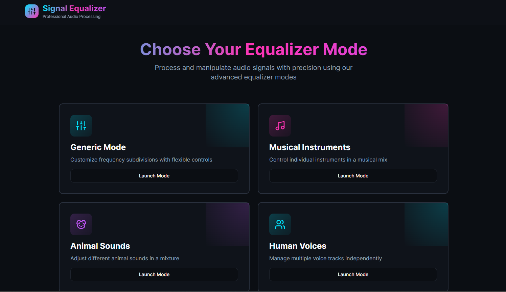
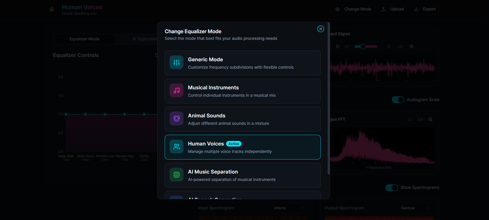
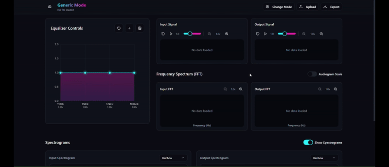
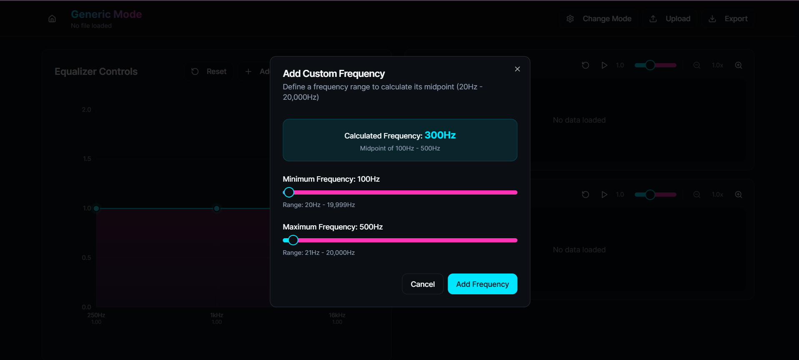
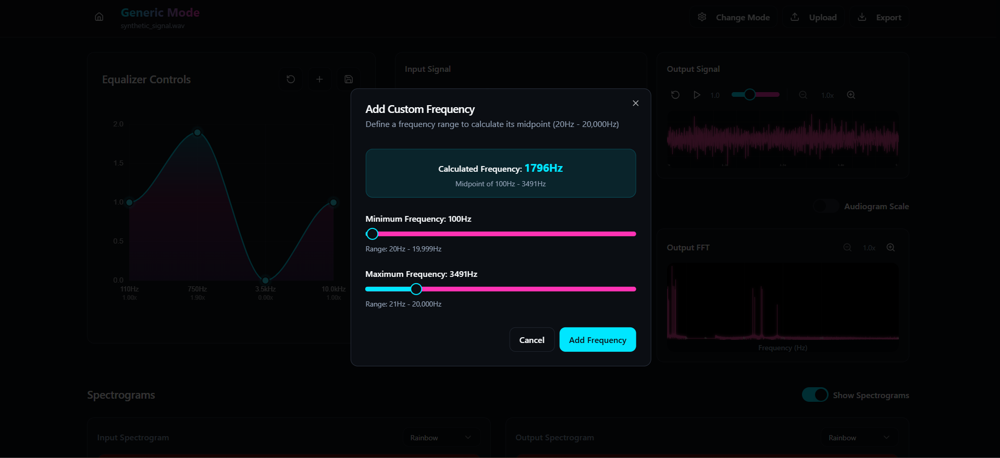
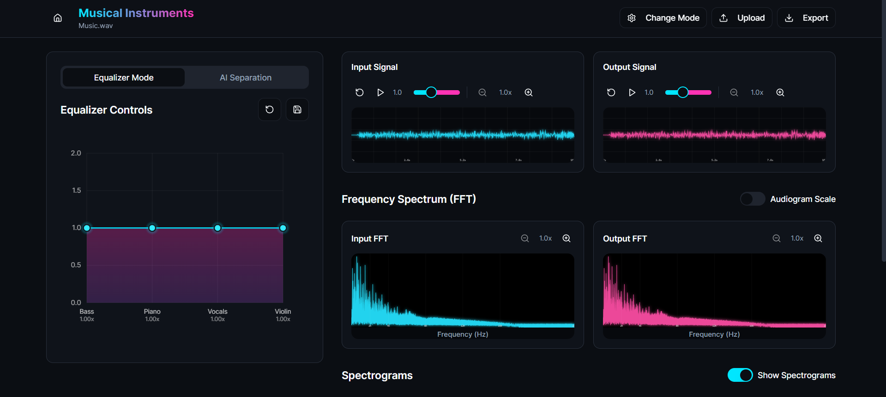
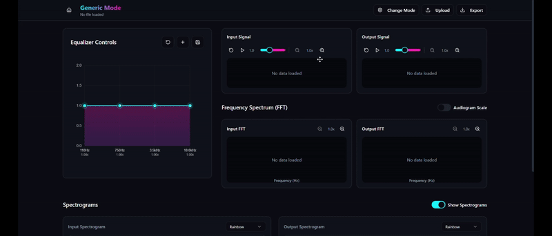
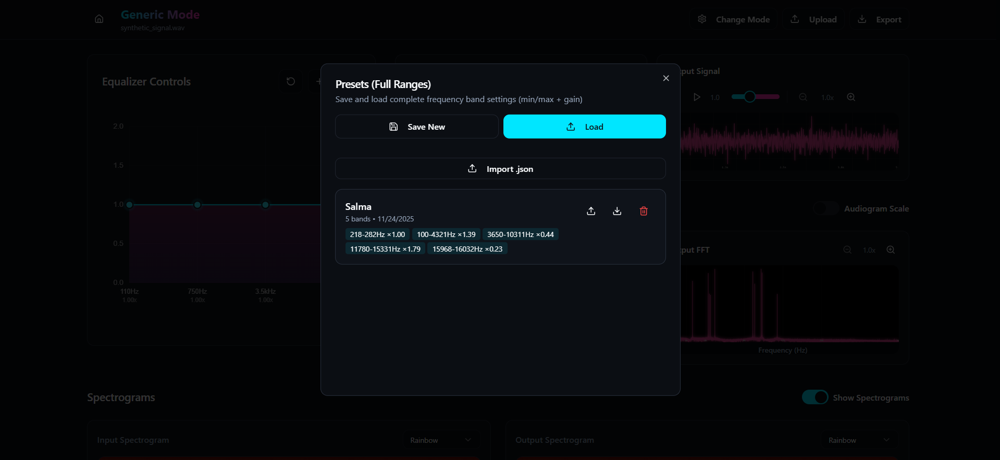
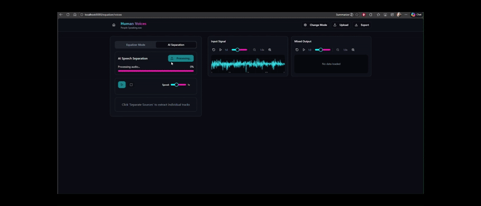
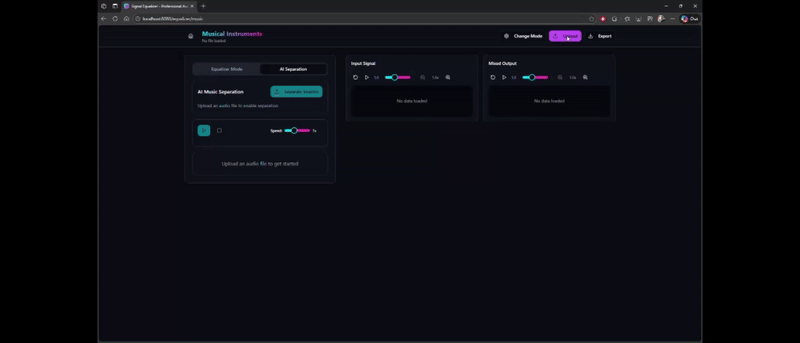

# Signal-Equalizer

A complete web-based interactive signal equalization and separation system

## 📌 Introduction

A **signal equalizer** is a fundamental tool in music, speech, and biomedical signal processing.
In biomedical engineering, equalization assists in **hearing-aid tuning**, **abnormality detection**, and **audio-based diagnostics**.

This project implements a **web application** that loads an input signal, decomposes it into frequencies, and allows users to manipulate the magnitude of selected frequency components through various modes. The processed signal is then reconstructed, visualized, and optionally played as audio.

---

# 📖 Table of Contents

- [Features](#-features)
- [System Architecture](#-system-architecture)
- [Modes](#-modes)
  - [Generic Mode](#1-generic-mode)
  - [Customized Modes](#2-customized-modes)
- [Signal Visualization](#-signal-visualization)
- [Spectrograms](#-spectrograms)
- [Audiogram Scale Support](#-audiogram-scale-support)
- [AI Models](#-ai-models)
- [Contributors](#-contributors)

## 🚀 Features

### ✨ Core Features

- Load and process 1-D time-domain signals (WAV, CSV, MAT, etc.).
- Full custom equalization through user-defined frequency windows.
- Real-time Fourier Transform (custom implementation — _no external FFT libraries_).
- Real-time signal reconstruction using inverse Fourier transform (custom implementation).
- Linked time-domain cine viewers for input & output signals.
- Dual spectrogram visualization (input vs output).
- Audio playback for compatible signals.
- Save/Load **equalizer preset settings** for all modes.

### ✨ UI Features

- Smooth mode switching (dropdown / combobox).
- Automatic generation of sliders and controls when loading a settings file.
- Toggle spectrogram visibility.
- Zoom, pan, speed control, and reset in cine viewers.
- Synchronous time navigation between input and output viewers.
- Linear and **Audiogram** frequency scale support.

---

## 🧩 System Architecture

Signal Loader → Fourier Transform → Equalizer Engine → Inverse Transform
→ Visualization (Cine Viewers, Spectrograms)
→ Audio Output (optional)
→ Settings Manager (Presets)

## 1. Generic Mode

A fully customizable mode where the user builds their own equalizer by adding frequency subdivisions manually.

### Features

- Add/remove subdivisions dynamically.
- Control each subdivision’s:
  - Start frequency
  - End frequency
  - Scale (0 → mute, 1 → unchanged, 2 → amplify)
- Save created scheme as a preset file (JSON).
- Load presets and regenerate the full UI automatically.

### Validation

A synthetic test signal composed of multiple pure tones is used to verify that frequency manipulation behaves correctly.

  
  

## 2. Customized Modes

Each mode contains **fixed sliders**, each representing **one sound source**, which may map to **multiple frequency windows**.

### 🟧 Musical Instruments Mode

Control the magnitude of different **instruments** in a mixed track:

- Piano
- Guitar
- Bass
- Vocals

### 🟩 Animal Sounds Mode

Control the magnitude of different **animal sounds** in a mix:

- Dog
- Cat
- Bird
- Horse

### 🟦 Human Voices Mode

Control different **people** in a multi-speaker mixture. Voices may differ by:

- Gender
- Age
- Language
- Timbre

### Shared Features

- Slider-to-frequency mapping is **non-contiguous**.
- Presets are externally editable.
- UI remains consistent across modes (labels & number of sliders change only).

---

## 📊 Signal Visualization

### 🎬 Linked Cine Viewers

Two synchronized time-domain viewers:

- **Input Signal Viewer**
- **Output Signal Viewer**

Both include:

- Play / Pause / Stop
- Playback speed control
- Zoom & pan
- Boundary-aware scrolling
- Perfect synchronization

## 🎧 Audio Playback

Any time-domain signal can be played as sound (if applicable).

---

## 🌈 Spectrograms

Two spectrograms:

- Input spectrogram
- Output spectrogram

### Features

- Fully custom implementation (no libraries).
- Real-time update on slider changes.
- Show/hide toggle.

---

## 🔊 Audiogram Scale Support

Frequency axis can switch between:

- Linear frequency scale
- **Audiogram scale** (hearing-perception based)

Switching scales does **not** reset any settings.

---

## 🤖 AI Models

Two pretrained models are provided for comparison.

### 1. Human Voice Separation AI Model

Used to compare with **Human Voices Mode**.

### 2. Musical Instrument Separation AI Model

Used to compare with **Musical Instruments Mode**.

#### Comparison Metrics

- Separation accuracy
- Signal quality
- Interference reduction
- Runtime
- Manual vs AI control

---

## 👥 Contributors

|  |  |  |  |
| :------------------------------------------------------------------------------------------------------------------------------------------------------------------: | :----------------------------------------------------------------------------------------------------------------------------------------------------: | :--------------------------------------------------------------------------------------------------------------------------------------------------------: | :--------------------------------------------------------------------------------------------------------------------------------------------------------------: |
|                                                    [**Raghad Abdelhameed**](https://github.com/RaghadAbdelhameed)                                                    |                                                     [**Salma Ali**](https://github.com/Salmaa-Ali)                                                     |                                                [**Youssef Mohamed Wanis**](https://github.com/YoussefWanis)                                                |                                                     [**Rawan Mohamed**](https://github.com/rawan-mohamed-n)                                                      |

---
